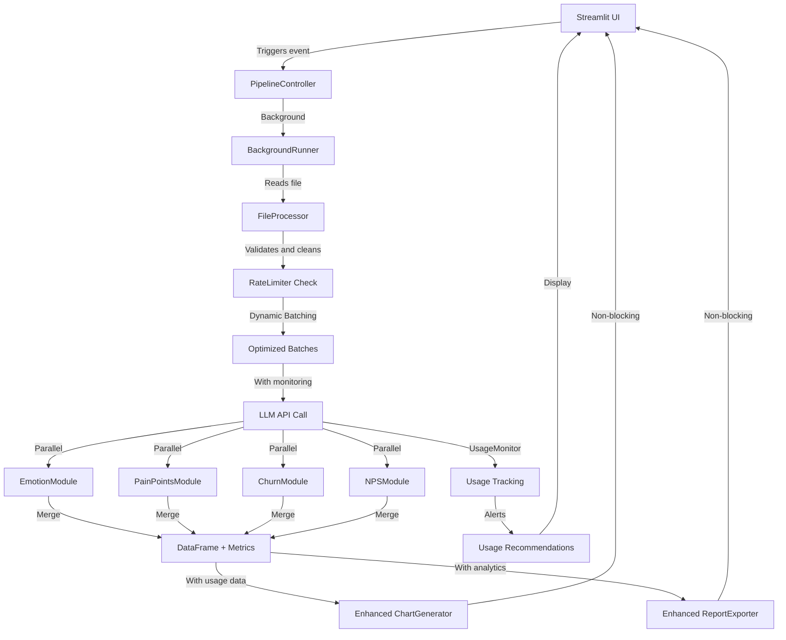

# System Architecture v2.0

## Anti-Overengineering Rules ✅

1. **UI only in `pages/` + `static/`** (no business logic)
2. **Logic in `core/`** (completely separated from Streamlit)
3. **≤480 lines per file** (no circular imports)
4. **Controller Architecture** in `controller/` using PipelineController
5. **Intelligent Rate Limiting** in `utils/rate_limiter.py` with UsageMonitor
6. **SLA**: ≤10s P50 for 800-1200 rows with usage monitoring

### New Features v2.0
- **Controller Architecture**: PipelineController + BackgroundRunner for non-blocking UI
- **Rate Limiting**: Intelligent RateLimiter with token counting and backoff
- **Usage Monitoring**: UsageMonitor with alerts and recommendations
- **Dynamic Batching**: Automatic batch size adjustment based on API usage
- **Production Config**: Secrets management and API tier configuration
- **Background Processing**: Asynchronous processing for better UX

## Project Structure

```
/Comment-Analizer-Personal/
│
├── .streamlit/
│   ├── config.toml                   # Streamlit configuration
│   └── secrets.toml                  # API keys and secrets
├── .gitignore
├── README.md
├── requirements.txt
├── streamlit_app.py                  # main entrypoint
├── config.py                         # dynamic configuration + rate limits
│
├── controller/                       # NEW: Controller Architecture
│   ├── controller.py                 # Main PipelineController
│   ├── background_runner.py          # Background processing
│   ├── state_manager.py              # Advanced state management
│   └── interfaces.py                 # Interfaces and contracts
│
├── pages/
│   ├── 1_Landing_Page.py             # UI: home + navigation
│   └── 2_Subir.py                    # UI: upload Excel, analysis, reports
│
├── static/
│   ├── css/
│   │   ├── glassmorphism_styles.css  # Main styles
│   │   └── buttons.css               # Button styles
│   ├── charts_css/
│   │   ├── chart_pie.css
│   │   └── chart_tower.css
│   └── images/
│
├── core/                             # PURE LOGIC (no Streamlit)
│   ├── ai_engine/
│   │   ├── engine_controller.py      # orchestrates: parse→batch→LLM→merge
│   │   ├── prompt_templates.py       # prompt templates
│   │   ├── api_call.py               # parallel with ThreadPool; retries; JSON
│   │   ├── emotion_module.py         # 16 emotions (multilingual)
│   │   ├── pain_points_module.py     # pain points analysis
│   │   ├── churn_module.py           # churn risk analysis
│   │   └── nps_module.py             # NPS analysis
│   ├── file_processor/
│   │   ├── reader.py                 # Excel→DataFrame
│   │   ├── cleaner.py                # dropna, trim, token truncation
│   │   ├── validator.py              # columns: NPS | Nota | Comentario Final
│   │   └── normalizer.py             # language, lower/utf-8, etc.
│   └── progress/
│       ├── tracker.py                # timing per stage (no UI)
│       └── state_iface.py            # neutral state interface (no st.*)
│
├── components/                       # UI INTEGRATION LAYER (Streamlit)
│   ├── ui_components/
│   │   ├── uploader.py               # file_uploader + light validations
│   │   ├── chart_generator.py        # Plotly/Matplotlib + styles
│   │   └── report_exporter.py        # export to Excel/CSV
│   └── reusable_components/          # buttons, layouts, progress bars
│
├── utils/                            # UPDATED: More utilities
│   ├── streamlit_helpers.py          # wrappers for spinners, session_state
│   ├── performance_monitor.py        # decorator @measure_time
│   ├── rate_limiter.py               # NEW: Intelligent rate limiting
│   ├── usage_monitor.py              # NEW: Usage tracking and alerts
│   └── logging_helpers.py            # consistent logging
│
├── docs/                             # DOCUMENTATION
│   ├── ES/
│   │   ├── 00_Introduccion.md
│   │   ├── 01_Arquitectura.md        # this file
│   │   ├── 02_Flujo_Pipeline.md
│   │   ├── 03_Guia_Desarrollo.md
│   │   ├── 04_Despliegue.md
│   │   ├── 05_Seguridad_y_Secretos.md
│   │   └── 06_FAQ.md
│   └── EN/
│       ├── 00_Introduction.md
│       ├── 01_Architecture.md        # this file
│       ├── 02_Pipeline_Flow.md
│       ├── 03_Dev_Guide.md
│       ├── 04_Deployment.md
│       ├── 05_Security_and_Secrets.md
│       └── 06_FAQ.md
│
└── local-reports/                    # SENSITIVE OUTPUTS (NOT VERSIONED)
```

## Separation of Responsibilities v2.0

### Core Layer (No UI)
- **`ai_engine/`**: AI logic with integrated rate limiting
- **`file_processor/`**: Robust Excel/CSV file handling
- **`progress/`**: Progress tracking without UI dependencies

### Controller Layer (NEW)
- **`controller/`**: Orchestration and background processing
- **`PipelineController`**: Centralized pipeline control
- **`BackgroundRunner`**: Asynchronous processing
- **`StateManager`**: Advanced state management

### UI Layer (Streamlit Only)
- **`pages/`**: Application pages
- **`components/ui_components/`**: UI components + usage dashboards
- **`utils/streamlit_helpers.py`**: Streamlit-specific helpers

### Integration Layer
- **`components/`**: Unites Core, Controller and UI
- **`utils/`**: Rate limiting, usage monitoring, performance
- **`config.py`**: Dynamic configuration with secrets

## Data Flow v2.0



## Design Patterns v2.0

### 1. **Enhanced Controller Pattern**
`PipelineController` + `BackgroundRunner` orchestrate without blocking UI.

### 2. **Rate Limiting Pattern**
`RateLimiter` + `UsageMonitor` prevent errors and optimize costs.

### 3. **Observer Pattern**
`UsageMonitor` observes usage and generates alerts/recommendations.

### 4. **State Manager Pattern**
`StateManager` handles complex state between UI and background processing.

### 5. **Factory Pattern**
Dynamic configuration based on API tier and secrets.

### 6. **Background Processing Pattern**
`BackgroundRunner` enables asynchronous processing without blocks.

### 7. **Intelligent Batching Pattern**
Dynamic batch sizing based on token usage and rate limits.

## Performance v2.0

### Intelligent Rate Limiting
- **RateLimiter** with precise token counting using tiktoken
- **Dynamic backoff** with jitter to avoid thundering herd
- **Usage-based batch sizing** that adjusts to API tier
- **Proactive 429 prevention** with real-time monitoring

### Optimized Concurrency
- **ThreadPoolExecutor** for parallel processing
- **BackgroundRunner** for non-blocking UI
- **Dynamic worker count** based on API limits
- **Optimized batches** according to token usage and rate limits

### Advanced Monitoring
- **SLA Targets** with usage cost tracking
- **UsageMonitor** with automatic alerts
- **Performance tracking** with API metrics
- **Recommendations engine** for optimization

### Caching & State
- **Streamlit caching** for results
- **Advanced state management** with StateManager
- **Usage metrics caching** for analytics
- **Background state preservation** during processing

## Error Handling v2.0

### Enhanced Fallback Levels
1. **Rate Limit Error (429)** → Intelligent backoff with jitter
2. **API Error** → Mock mode with simulated data
3. **Token Limit Error** → Dynamic batch size reduction
4. **Parsing Error** → Default values + usage logging
5. **File Error** → Clear message + robust validation
6. **Memory Error** → Automatic reduction + alerts

### Advanced Logging
```python
# Error tracking with usage context
logger.error(f"Failed batch {batch_id}: {error}, usage: {usage_stats}")
# Rate limit incident tracking
usage_monitor.log_rate_limit_incident(batch_id, retry_count)
# Cost impact analysis
cost_tracker.log_failed_batch_cost(batch_id, tokens_wasted)
# Automated recovery recommendations
recommendation_engine.suggest_optimization(error_pattern)
```

### Recovery Strategies (NEW)
- **Adaptive Batch Sizing**: Automatic reduction on errors
- **Smart Retry**: Backoff based on error type
- **Usage-based Fallback**: Mock mode when usage is high
- **Cost Protection**: Automatic spending limits

## Configuration Management v2.0

### API Tier Configuration
```python
# config.py - Dynamic configuration based on API tier
def get_rate_limits() -> Dict[str, Any]:
    provider = get_secret("API_PROVIDER", "openai").lower()
    tier = get_secret("API_TIER", "tier_1").lower()

    if provider == "azure":
        return AZURE_RATE_LIMITS.get(tier, AZURE_RATE_LIMITS["standard"])
    else:
        return OPENAI_RATE_LIMITS.get(tier, OPENAI_RATE_LIMITS["tier_1"])
```

### Secrets Management
```python
# Streamlit secrets with environment fallback
def get_secret(key: str, default: str = "") -> str:
    try:
        import streamlit as st
        if hasattr(st, 'secrets') and key in st.secrets:
            return st.secrets[key]
    except:
        pass
    return os.environ.get(key, default)
```

## Scalability Features

### Dynamic Resource Allocation
- **API tier awareness**: Automatic limits based on OpenAI tier
- **Usage-based optimization**: Batch size adjustment in real-time
- **Cost monitoring**: Automatic alerts and recommendations
- **Performance adaptation**: Response to API performance changes

### Production Readiness
- **Robust error handling**: Multiple fallback strategies
- **Usage analytics**: Detailed cost and performance tracking
- **Background processing**: Non-blocking user experience
- **Configuration management**: Environment-aware settings

This v2.0 architecture ensures production-ready deployment with intelligent cost optimization and comprehensive monitoring capabilities.