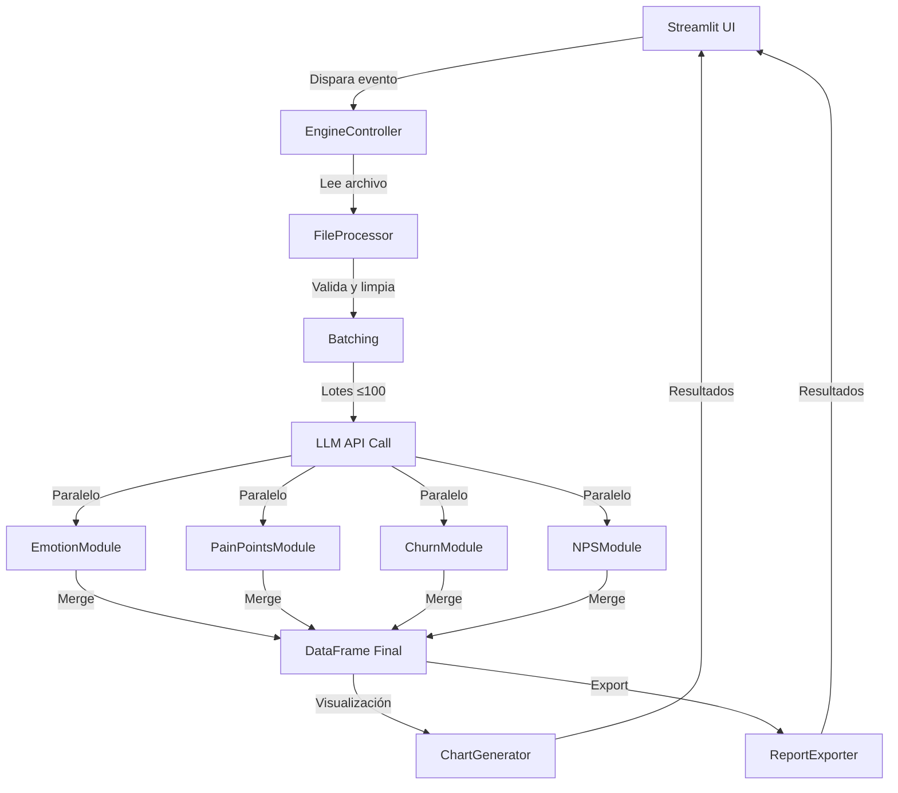

# Arquitectura del Sistema

## Reglas Anti-Overengineering

1. **UI solo en `pages/` + `static/`** (sin lógica de negocio)
2. **Lógica en `core/`** (completamente separada de Streamlit)
3. **≤480 líneas por archivo** (sin imports cíclicos)
4. **Concurrencia paralela** en `core/ai_engine/api_call.py` usando ThreadPoolExecutor
5. **Estado/caché** manejado en UI layer (session_state, cache_data/resource)
6. **SLA**: ≤10s P50 para 800-1200 filas (monitoreo en `utils/performance_monitor.py`)

## Estructura del Proyecto

```
/Comment-Analizer-Personal/
│
├── .streamlit/
│   └── config.toml                   # Configuración Streamlit
├── .gitignore
├── README.md
├── requirements.txt
├── streamlit_app.py                  # entrypoint principal
├── config.py                         # constantes: emociones, batch, modelo, etc.
│
├── pages/
│   ├── 1_Landing_Page.py             # UI: portada + navegación
│   └── 2_Subir.py                    # UI: subir Excel, análisis, reportes
│
├── static/
│   ├── css/
│   │   ├── glassmorphism_styles.css  # Estilos principales
│   │   └── buttons.css               # Estilos de botones
│   ├── charts_css/
│   │   ├── chart_pie.css
│   │   └── chart_tower.css
│   └── images/
│
├── core/                             # LÓGICA PURA (sin Streamlit)
│   ├── ai_engine/
│   │   ├── engine_controller.py      # orquesta: parse→batch→LLM→merge
│   │   ├── prompt_templates.py       # plantillas de prompts
│   │   ├── api_call.py               # paralelo con ThreadPool; retries; JSON
│   │   ├── emotion_module.py         # 16 emociones (multilengua)
│   │   ├── pain_points_module.py     # análisis de pain points
│   │   ├── churn_module.py           # análisis de riesgo churn
│   │   └── nps_module.py             # análisis NPS
│   ├── file_processor/
│   │   ├── reader.py                 # Excel→DataFrame
│   │   ├── cleaner.py                # dropna, trim, truncado tokens
│   │   ├── validator.py              # columnas: NPS | Nota | Comentario Final
│   │   └── normalizer.py             # idioma, lower/utf-8, etc.
│   └── progress/
│       ├── tracker.py                # tiempos por etapa (no UI)
│       └── state_iface.py            # interfaz neutral de estado (sin st.*)
│
├── components/                       # CAPA DE INTEGRACIÓN UI (Streamlit)
│   ├── ui_components/
│   │   ├── uploader.py               # file_uploader + validaciones ligeras
│   │   ├── chart_generator.py        # Plotly/Matplotlib + estilos
│   │   └── report_exporter.py        # export a Excel/CSV
│   └── reusable_components/          # botones, layouts, barras progreso
│
├── utils/
│   ├── streamlit_helpers.py          # wrappers para spinners, session_state
│   ├── performance_monitor.py        # decorator @measure_time
│   └── logging_helpers.py            # logging consistente
│
├── docs/                             # DOCUMENTACIÓN
│   └── ES/
│       ├── 00_Introduccion.md
│       ├── 01_Arquitectura.md        # este archivo
│       ├── 02_Flujo_Pipeline.md
│       ├── 03_Guia_Desarrollo.md
│       ├── 04_Despliegue.md
│       ├── 05_Seguridad_y_Secretos.md
│       └── 06_FAQ.md
│
└── local-reports/                    # SENSITIVE OUTPUTS (NO VERSIONAR)
```

## Separación de Responsabilidades

### Core Layer (Sin UI)
- **`ai_engine/`**: Toda la lógica de IA y procesamiento
- **`file_processor/`**: Manejo de archivos Excel/CSV
- **`progress/`**: Tracking de progreso sin dependencias UI

### UI Layer (Solo Streamlit)
- **`pages/`**: Páginas de la aplicación
- **`components/ui_components/`**: Componentes UI reutilizables  
- **`utils/streamlit_helpers.py`**: Helpers específicos de Streamlit

### Integration Layer
- **`components/`**: Une Core y UI sin violar separación
- **`utils/`**: Utilities generales (logging, performance)
- **`config.py`**: Configuración centralizada

## Flujo de Datos



## Patrones de Diseño

### 1. **Controller Pattern**
`EngineController` orquesta todo el pipeline sin conocer detalles de UI.

### 2. **Module Pattern**  
Cada tipo de análisis (emotions, churn, etc.) en módulos separados.

### 3. **State Management**
Estado manejado en UI layer usando `st.session_state`.

### 4. **Dependency Injection**
`LLMApiClient` inyectado en controller para testabilidad.

### 5. **Configuration Pattern**
Toda configuración centralizada en `config.py` con secrets support.

## Performance

### Concurrencia
- **ThreadPoolExecutor** para procesamiento paralelo de lotes
- **Máximo 12 workers** configurables
- **Lotes de ≤100 comentarios** para optimizar llamadas API

### Monitoring  
- **SLA Targets** definidos para cada etapa
- **Performance tracking** en `utils/performance_monitor.py`
- **Logging** estructurado para debugging

### Caching
- **Streamlit caching** para resultados de análisis  
- **Session state** para mantener estado entre reruns
- **File caching** en `local-reports/` para exports